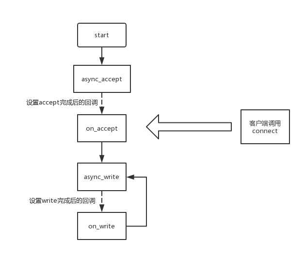
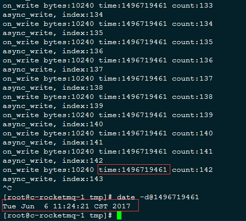
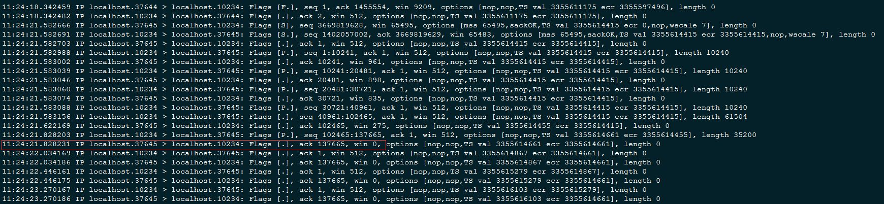
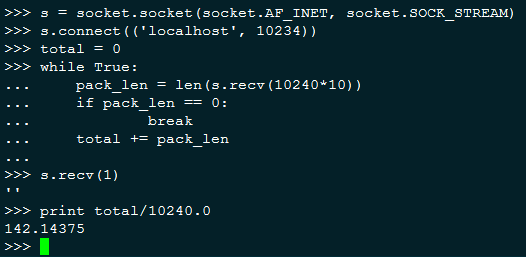

<<<<<<< HEAD
# Boost Asio async_write回调行为分析
=======
Title: Boost Asio async_write回调行为分析
Date: 2017-11-09
Modified: 2017-11-09
Category: Language
Tags: boost
Slug: Boost Asio async_write回调行为分析
Author: littlewhite

[TOC]

>>>>>>> deafb6bb75f8350a7d4f1bebb85ba7f79f9f4369
本文主要分析async_write在一些边界情况下的回调行为，包括如下几点

1. 对方接受缓慢
2. 对方正常关闭
3. 对方异常关闭
2. 主动shutdown_receive
3. 主动shutdown_send
4. 主动shutdown_both

先给出结论

>正常情况下async_write将数据写入socket发送缓冲区就会触发回调  
>在以下情况下async_write回调也会被触发，并携带相应错误码：对方关闭（close, kill, kill -9)，主动shutdown_send，主动shutdown_both

## 基本知识
每个tcp socket在内核都有发送缓冲区和接收缓冲区，发送函数send只是将数据写入发送缓冲区，接受函数recv是将数据从接收缓冲区拷贝到应用层，当接收缓冲区已满时，收端会通知发端接收窗口关闭（win=0)。真正的tcp发送是由内核协议来完成的，即便发送进程退出，只要发送缓冲区还有数据，对方仍旧能收到这部分数据

async_write底层调用的async_write_some，可能会分多次调用，最终的发送也是将数据写入发送缓冲区，只有当async_write的所有数据都写入缓冲区，async_write的回调才会被调用

## 发送缓冲区写满的回调分析
我们设计这样一种场景，当客户端连接上之后，服务端即调用async_write向其发送数据，并且在回调函数里继续调用async_write，观察回调情况，流程如下

<<<<<<< HEAD

=======

>>>>>>> deafb6bb75f8350a7d4f1bebb85ba7f79f9f4369

每次async_write发送10K数据，并且客户端连接上来之后不调用recv，模拟接受缓慢的场景，观察on_write调用次数，关键代码如下

	int g_write_count = 1000;                                                                                                                                                                                           
	int g_write_size = 1024 * 10;                                                                                                                                                                                       
	int g_index = 0;

	void on_write(Context* context, const boost::system::error_code &err, std::size_t bytes)                                                                                                                            
	{                                                                                                                                                                                                                   
	    if (err)                                                                                                                                                                                                        
	    {                                                                                                                                                                                                               
	        cout << "on_write, err:" << err.message() << endl;                                                                                                                                                          
	        context->socket->close();                                                                                                                                                                                   
	        delete context->socket;
			context->socket = NULL;                                                                                                                                                                                     
	        delete context;                                                                                                                                                                                             
	        return ;                                                                                                                                                                                                    
	    } 
                                                                                                                                                                                                              
	    static int count = 0;                                                                                                                                                                                           
	    cout << "on_write bytes:" << bytes << " time:" << time(NULL) << " count:" << ++count << endl;                                                                                                                   
	                                                                                                                                                                                                                    
	    if (g_index < g_write_count)                                                                                                                                                                                    
	    {                                                                                                                                                                                                               
	        context->write_buf = (char*)malloc(g_write_size);                                                                                                                                                           
	        memset(context->write_buf, 'a', g_write_size);                                                                                                                                                              
	                                                                                                                                                                                                                    
	        async_write(*context->socket, buffer(context->write_buf, g_write_size), boost::bind(&on_write, context, placeholders::error, placeholders::bytes_transferred));                                             
	        cout << "async_write, index:" << ++g_index << endl;                                                                                                                                                         
	                                                                                                                                                                                                                    
	        delete context->write_buf;                                                                                                                                                                                  
	        context->write_buf = NULL;                                                                                                                                                                                  
	    }                                                                                                                                                                                                               
	}

客户端是用Python解释器进行交互式操作，便于分析每一步的结果

测试步骤为

1. 启动服务端
2. Python客户端连接服务端
3. 退出服务端
4. Python客户端继续读取数据

在这个过程中同时进行抓包分析，我们发现

**客户端连接上来之后（即步骤2完成之后）服务端一共调用了142次回调，第143次async_write的回调并没有调用**

<<<<<<< HEAD

**此时客户端的接收缓冲区已满（注意观察两图的时间戳）**

=======

**此时客户端的接收缓冲区已满（注意观察两图的时间戳）**

>>>>>>> deafb6bb75f8350a7d4f1bebb85ba7f79f9f4369

**服务端退出之后客户端仍旧能读到数据，并且读到的数据包（这里以10K作为一个数据包）数量正好介于142和143之间**

<<<<<<< HEAD

=======

>>>>>>> deafb6bb75f8350a7d4f1bebb85ba7f79f9f4369

结合前面的基础知识分析这个过程如下

1. 客户端连接上来之后服务端开始调用async_write，当数据被写入发送缓冲区时回调函数即被调用
2. 内核协议将发送缓冲区数据发送给客户端，写入接收缓冲区，直到对方接收缓冲区写满，这个过程中步骤1一直在执行（一共执行了142次）
3. 当服务端调用第143次async_write时，由于发送缓冲区空间不够，因此回调没有发生，但仍旧写入了一部分数据
4. 服务端退出后客户端读取接受缓冲区数据，同时内核将发送缓冲区数据发送给客户端，这个数据量为前142次async_write写入的全部数据加第143次async_write写入的部分数据

倘若服务端不退出，当客户端读取一部分数据后，第143次async_write的回调即会发生，这里就不贴出相应数据了

从以上分析可以看出，当数据写入发送缓冲区后async_write的回调即会发生，如果发送缓冲区已满，async_write的回调不会发生

## socket关闭的回调分析
还是使用前面的服务端和客户端程序，测试场景如下

1. 启动服务端
2. Python客户端连接上服务端，服务端调用一次async_write sleep 15秒钟，让客户端有充足的时间执行操作
3. 客户端分别在不读取缓冲区和读完缓冲区的两种情况下执行close, kill, kill -9，并抓包进行分析
4. 对服务端通过发送kill -15的信号执行shutdown_send, shutdown_receive, shutdown_both，分析回调行为

服务端通过捕捉信号执行shutdown操作如下

	void SignalHandler( int signum  )                                                                                                                                                                                   
	{                                                                                                                                                                                                                   
	    cout << "Interrupt signal (" << signum << ") received" << endl;                                                                                                                                                 
	                                                                                                                                                                                                                    
	    boost::system::error_code ec;                                                                                                                                                                                   
	    g_socket->shutdown(boost::asio::ip::tcp::socket::shutdown_send, ec);                                                                                                                                            
	    //g_socket->shutdown(boost::asio::ip::tcp::socket::shutdown_receive, ec);                                                                                                                                       
	    //g_socket->shutdown(boost::asio::ip::tcp::socket::shutdown_both, ec);                                                                                                                                          
	}

### 对端关闭（close，kill，kill -9）
如果对端接收缓冲区还有数据，关闭（close,kill, kill -9）会导致对端发送RST包，如下最后一行，此时本端调用async_write回立马产生回调，err参数为Connection reset by peer

    23:37:36.235495 IP localhost.50366 > localhost.9999: Flags [S], seq 1891887111, win 43690, options [mss 65495,sackOK,TS val 656034598 ecr 0,nop,wscale 7], length 0
    23:37:36.235504 IP localhost.9999 > localhost.50366: Flags [S.], seq 53115564, ack 1891887112, win 43690, options [mss 65495,sackOK,TS val 656034598 ecr 656034598,nop,wscale 7], length 0
    23:37:36.235514 IP localhost.50366 > localhost.9999: Flags [.], ack 1, win 342, options [nop,nop,TS val 656034598 ecr 656034598], length 0
    23:37:36.235749 IP localhost.9999 > localhost.50366: Flags [P.], seq 1:10241, ack 1, win 342, options [nop,nop,TS val 656034598 ecr 656034598], length 10240
    23:37:36.235757 IP localhost.50366 > localhost.9999: Flags [.], ack 10241, win 1365, options [nop,nop,TS val 656034598 ecr 656034598], length 0
    **** close/kill/kill -9 at this moment ****
    23:37:39.011643 IP localhost.50366 > localhost.9999: Flags [R.], seq 1, ack 10241, win 1365, options [nop,nop,TS val 0 ecr 656034598], length 0

如果对端接受缓冲区没有数据，通过close关闭或者被进程被kill，会发送FIN包，此时本端调用async\_write会收到正常回调，但对端回的是RST包，当下次调用async\_write时产生错误回调，err为Broken pipe

    23:46:13.105899 IP localhost.50369 > localhost.9999: Flags [S], seq 94591470, win 43690, options [mss 65495,sackOK,TS val 656163816 ecr 0,nop,wscale 7], length 0
    23:46:13.105909 IP localhost.9999 > localhost.50369: Flags [S.], seq 1590802765, ack 94591471, win 43690, options [mss 65495,sackOK,TS val 656163816 ecr 656163816,nop,wscale 7], length 0
    23:46:13.105922 IP localhost.50369 > localhost.9999: Flags [.], ack 1, win 342, options [nop,nop,TS val 656163816 ecr 656163816], length 0
    23:46:13.106132 IP localhost.9999 > localhost.50369: Flags [P.], seq 1:10241, ack 1, win 342, options [nop,nop,TS val 656163816 ecr 656163816], length 10240
    23:46:13.106139 IP localhost.50369 > localhost.9999: Flags [.], ack 10241, win 1365, options [nop,nop,TS val 656163816 ecr 656163816], length 0
    **** close/kill at this moment ***
    23:46:19.929814 IP localhost.50369 > localhost.9999: Flags [F.], seq 1, ack 10241, win 1365, options [nop,nop,TS val 656165522 ecr 656163816], length 0
    23:46:19.933364 IP localhost.9999 > localhost.50369: Flags [.], ack 2, win 342, options [nop,nop,TS val 656165523 ecr 656165522], length 0
    23:46:23.106636 IP localhost.9999 > localhost.50369: Flags [P.], seq 10241:20481, ack 2, win 342, options [nop,nop,TS val 656166316 ecr 656165522], length 10240
    23:46:23.106658 IP localhost.50369 > localhost.9999: Flags [R], seq 94591472, win 0, length 0

如果对端接收缓冲区没有数据，并且进程是被kill -9杀掉，则会发送RST包，和缓冲区有数据时退出一样，此时本端调用async_write会产生错误回调，err为Connection reset by peer，过程如下

    23:53:39.531436 IP localhost.50372 > localhost.9999: Flags [S], seq 1739017762, win 43690, options [mss 65495,sackOK,TS val 656275422 ecr 0,nop,wscale 7], length 0
    23:53:39.531449 IP localhost.9999 > localhost.50372: Flags [S.], seq 2103076725, ack 1739017763, win 43690, options [mss 65495,sackOK,TS val 656275422 ecr 656275422,nop,wscale 7], length 0
    23:53:39.531464 IP localhost.50372 > localhost.9999: Flags [.], ack 1, win 342, options [nop,nop,TS val 656275422 ecr 656275422], length 0
    23:53:39.531672 IP localhost.9999 > localhost.50372: Flags [P.], seq 1:10241, ack 1, win 342, options [nop,nop,TS val 656275422 ecr 656275422], length 10240
    23:53:39.531680 IP localhost.50372 > localhost.9999: Flags [.], ack 10241, win 1365, options [nop,nop,TS val 656275422 ecr 656275422], length 0
    **** kill -9 at this moment ****
    23:53:42.420885 IP localhost.50372 > localhost.9999: Flags [R.], seq 1, ack 10241, win 1365, options [nop,nop,TS val 0 ecr 656275422], length 0

### 本端关闭
本端通过shutdown\_send关闭，本端会发送FIN包，调用async\_write会产生错误回调，err为Broken pipe

    00:01:00.243682 IP localhost.50383 > localhost.9999: Flags [S], seq 859261593, win 43690, options [mss 65495,sackOK,TS val 656385600 ecr 0,nop,wscale 7], length 0
    00:01:00.243693 IP localhost.9999 > localhost.50383: Flags [S.], seq 2783724350, ack 859261594, win 43690, options [mss 65495,sackOK,TS val 656385600 ecr 656385600,nop,wscale 7], length 0
    00:01:00.243707 IP localhost.50383 > localhost.9999: Flags [.], ack 1, win 342, options [nop,nop,TS val 656385600 ecr 656385600], length 0
    00:01:00.244063 IP localhost.9999 > localhost.50383: Flags [P.], seq 1:10241, ack 1, win 342, options [nop,nop,TS val 656385600 ecr 656385600], length 10240
    00:01:00.244074 IP localhost.50383 > localhost.9999: Flags [.], ack 10241, win 1365, options [nop,nop,TS val 656385600 ecr 656385600], length 0
    **** shutdown at this moment ****
    00:01:02.275905 IP localhost.9999 > localhost.50383: Flags [F.], seq 10241, ack 1, win 342, options [nop,nop,TS val 656386108 ecr 656385600], length 0
    00:01:02.313533 IP localhost.50383 > localhost.9999: Flags [.], ack 10242, win 1365, options [nop,nop,TS val 656386118 ecr 656386108], length 0

本端调用shutdown\_both，结果同shutdown\_send  
本端调用shutdown\_receive，对async\_write回调没有影响

## 结论
综上可以看出，async_write的回调行为和连接是否正常以及连接关闭时收到的是RST包还是FIN包有关，总结如下

连接状态  | 对端接受缓冲区是否有数据 | async_write回调行为
:-- | :--: | :--
正常 |  -- | 写入缓冲区即回调，若缓冲区已满，暂时不会回调，会等到缓冲区可以写入之后才回调
对端关闭（close, kill, kill -9） | 是 | 本端收到RST包，下次async_write产生错误回调，err为Connection reset by peer
对端关闭（close, kill） | 否 | 本端收到FIN包，下次async_write正常回调并收到RST包（没有收到ACK包），再次err为Broken pipe
对端关闭（kill -9） | 否 | 本端收到RST包，下次async_write产生错误回调，err为Connection reset by peer
本端shutdown\_send,shutdown\_both | -- | 下次async_write产生错误回调，err为Broken pipe
本端shutdown_receive | -- | 对async\_write没有影响

## 完整服务端测试代码

	#include <signal.h>
	#include <unistd.h>
	#include <iostream>
	#include <string>
	#include "boost/asio.hpp"
	#include "boost/bind.hpp"
	#include "boost/thread.hpp"
	
	using namespace std;
	using namespace boost::asio;
	
	int g_write_count = 1000;
	int g_write_size = 1024 * 10;
	int g_index = 0;
	
	ip::tcp::socket* g_socket = NULL;
	
	struct Context
	{
	    Context(ip::tcp::socket* s, io_service* service, ip::tcp::acceptor* a) : socket(s), io(service), acceptor(a)
	    {
	
	    }
	
	    ip::tcp::socket* socket;
	    ip::tcp::acceptor* acceptor;
	    io_service* io;
	    char read_buf[1024];
	    char *write_buf;
	};
	
	void SignalHandler( int signum  )
	{
	    cout << "Interrupt signal (" << signum << ") received" << endl;
	
	    boost::system::error_code ec;
	    g_socket->shutdown(boost::asio::ip::tcp::socket::shutdown_send, ec);
	    //g_socket->shutdown(boost::asio::ip::tcp::socket::shutdown_receive, ec);
	    //g_socket->shutdown(boost::asio::ip::tcp::socket::shutdown_both, ec);
	}
	
	void on_read(Context* context, const boost::system::error_code &err, std::size_t bytes)
	{
	    if (err)
	    {
	        cout << "on_read, err:" << err.message() << endl;
	        return ;
	    }
	    cout << "on reawd, bytes:" << bytes << endl;
	    async_read(*context->socket, buffer(context->read_buf, 1024), boost::bind(&on_read, context, placeholders::error, placeholders::bytes_transferred));
	}
	
	void on_write(Context* context, const boost::system::error_code &err, std::size_t bytes)
	{
	    if (err)
	    {
	        cout << "on_write, err:" << err.message() << endl;
	        context->socket->close();
	        delete context->socket;
	        delete context;
	        return ;
	    }
	    static int count = 0;
	    cout << "on_write bytes:" << bytes << " time:" << time(NULL) << " count:" << ++count << endl;

		//sleep(15);
	
	    if (g_index < g_write_count)
	    {
	        context->write_buf = (char*)malloc(g_write_size);
	        memset(context->write_buf, 'a', g_write_size);
	
	        async_write(*context->socket, buffer(context->write_buf, g_write_size), boost::bind(&on_write, context, placeholders::error, placeholders::bytes_transferred));
	        cout << "async_write, index:" << ++g_index << endl;
	
	        delete context->write_buf;
	        context->write_buf = NULL;
	    }
	}
	
	void on_accept(Context* context, const boost::system::error_code & err)
	{
	    if (err)
	    {
	        cout << "on accept, err:" << err << endl;
	        return ;
	    }
	
	    boost::system::error_code re_ec;
	    ip::tcp::socket* socket = context->socket;
	    ip::tcp::endpoint endpoint = socket->remote_endpoint(re_ec);
	    cout << "remote addr " << endpoint.address().to_v4() << ":" << endpoint.port() << endl;
	
	    context->write_buf = (char*)malloc(g_write_size);
	    memset(context->write_buf, 'a', g_write_size);
	
	    async_write(*socket, buffer(context->write_buf, g_write_size), boost::bind(&on_write, context, placeholders::error, placeholders::bytes_transferred));
	    cout << "async_write, index:" << ++g_index << endl;
	    
	    async_read(*socket, buffer(context->read_buf, 1024), boost::bind(&on_read, context, placeholders::error, placeholders::bytes_transferred));
	
	    delete context->write_buf;
	    context->write_buf = NULL;
	
	    g_socket = context->socket;
	}
	
	int main(int argc, char* argv[]) 
	{
	    if (argc != 4)
	    {
	        cout << "usage: " << argv[0] << " port write_size write_count" << endl;
	        return 0;
	    }
	
	    signal(SIGTERM, SignalHandler);
	
	    int port = atoi(argv[1]);
	    g_write_size = atoi(argv[2]);
	    g_write_count = atoi(argv[3]);
	
	    io_service service;
	    boost::asio::ip::tcp::acceptor acceptor(service);
	    ip::tcp::endpoint endpoint(boost::asio::ip::tcp::v4(), port);
	    acceptor.open(endpoint.protocol());
	    acceptor.set_option(ip::tcp::acceptor::reuse_address(true));
	    acceptor.bind(endpoint);
	    acceptor.listen();
	    ip::tcp::socket* s = new ip::tcp::socket(service);
	    Context* context = new Context(s, &service, &acceptor);
	    acceptor.async_accept(*s, boost::bind(&on_accept, context, _1));
	    
	    service.run();
	    return 0;
	}

