# boost内存池singleton_pool详解
## 基本概念
内存池可以避免频繁分配释放内存时导致操作系统内存碎片的问题

boost内存池提供了如下对象

* singleton_pool
	
	对pool内存池的封装，在其基础上加了锁，避免多线程操作的安全问题，并暴露了常用的接口。

* pool

	真正内存池的实现，管理block链表，并交给simple_segregated_storage分割成固定长度的chunk，每次给用户分配1个或多个chunk，每个chunk都是固定长度的

* simple_segregated_storage

	将block分割成chunk并组成链表进行管理

通常我们使用的都是singleton_pool对象

## 接口定义
这里只列出常用接口

	template <typename Tag,
	    unsigned RequestedSize,
	    typename UserAllocator,
	    typename Mutex,
	    unsigned NextSize,
	    unsigned MaxSize >
	class singleton_pool
	{
	public:
	    static void * malloc();
	    static void * ordered_malloc();
	    static void * ordered_malloc(const size_type n);
	    static bool is_from(void * const ptr);
	    static void free(void * const ptr);
	    static void ordered_free(void * const ptr);
	    static void free(void * const ptr, const size_type n);
	    static void ordered_free(void * const ptr, const size_type n);
	    static bool release_memory();
	    static bool purge_memory();
	};

先看几个模板参数的含义

* `Tag`: 一般定义为一个struct类型，用来唯一标识内存池对象
* `RequestSize`: 每次向内存池请求的内存大小
* `UserAllocator`: 用户自定义的内存分配器，向操作系统申请释放内存时使用，默认为boost::default_user_allocator_new_delete
* `Mutex`: 互斥锁，默认为boost::details::pool::default_mutex
* `NextSize`: 内存池向操作系统第一次申请内存的chunk数量，默认为32
* `MaxSize`: 内存池向操作系统申请一次内存的最大chunk数量，默认为0，代表无上限

使用方法如下

	struct MyPoolTag
	{
	
	};
	
	typedef boost::singleton_pool<MyPoolTag, 1024> my_pool;
	
	int main()
	{
		char * p = (char*)my_pool::malloc(); // 分配内存大小为1024byte
		my_pool::free(p);
		return 0;
	}

malloc和free用来向内存池分配和归还内存，ordered_*代表顺序内存的操作，release_memory可以释放ordered内存池里的空闲block，purge_memory强制释放内存池所有block，具体行为后续分析

## 数据结构
内存池里有两个关键对象，分别为block和chunk

### block的管理
block为一大块连续的内存，chunk是由block分隔的等长内存块，其结构如下

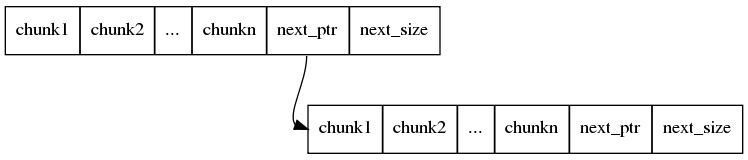

block由pool对象进行管理，组成链表，next_ptr指向下个block，next_size为下个block的大小。对于非ordered内存池，每次申请的block放入链表头，如果是ordered内存池，则需要将block插入合适的位置，保持block起始地址的顺序

假设RequestSize为1K，NextSize为默认值32， MaxSize为默认值0，那么第一次向内存池请求内存时，由于没有可用的block，内存池会向操作系统申请第一个block，包含32个chunk，当第一个block用完之后，下一次申请的block会包含64个chunk（为前一次的2倍），依次内推，如果指定的MaxSize大于0，则一次申请的block最多包含MaxSize个chunk

### chunk的管理
每个block都交由simple_segregated_storage分割成chunk并进行管理，chunk也组成链表

block分割之后结构如下

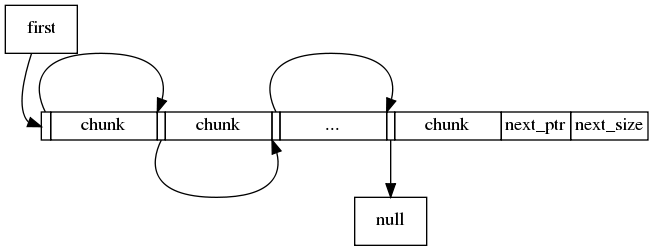

first指向第一个可用的chunk，每个chunk指向相邻的chunk。多个block之间的chunk也会组成链表（真实场景中chunk可能并不是有序的）

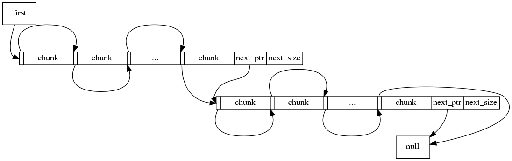

在初始化的时候，block中的chunk指向其物理地址相邻的且起始地址比它大的chunk，最后一个chunk指向NULL或下一个block的第一个chunk

## 分配内存
分配内存接口如下

    static void * malloc();
    static void * ordered_malloc();
    static void * ordered_malloc(const size_type n);

malloc会返回第一个可用的chunk给用户，复杂度为O(1)，ordered_malloc还会保持block和chunk的顺序，复杂度为O(N)，只有在分配连续n个chunk时比较适用，其它时候不推荐使用ordered内存池

假设NextSize为2，当我们调用4次malloc，分别分配buf1, buf2, buf3, buf4, 其过程如下

* 分配buf1，没有可用block，内存池向操作系统申请block，包含2个chunk，并返回第一个chunk给用户

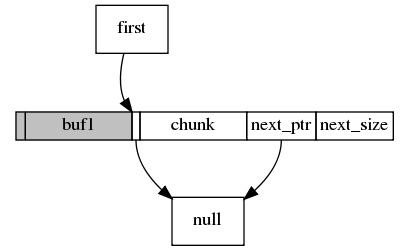

* 分配buf2，有可用的block，直接返回first指向的chunk给用户，同时first指向NULL

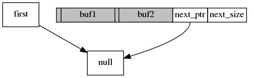

* 分配buf3，没有可用的block，内存池向操作系统申请新的block，包含4个chunk，并返回第一个chunk给用户，新的block插入block链表的头部

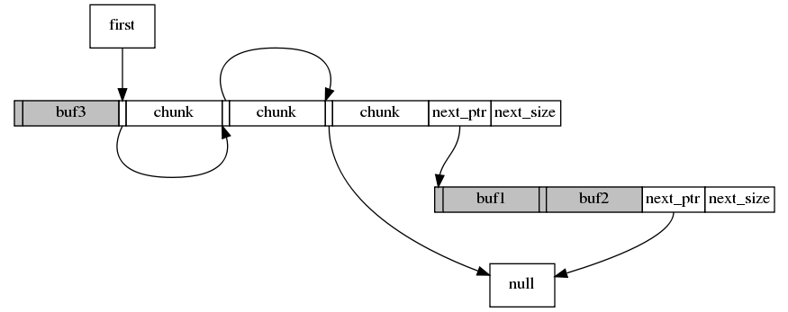

* 分配buf4，有可用的block，直接返回first指向的chunk给用户

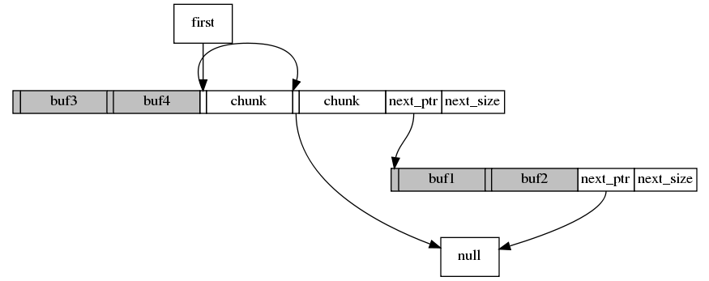

对于ordered_malloc，其区别在于向操作系统申请新的block之后，会将block插入合适的位置，以保持block地址的顺序性

## 归还内存
归还内存接口如下

    static void ordered_free(void * const ptr);
    static void free(void * const ptr, const size_type n);
    static void ordered_free(void * const ptr, const size_type n);

free会将归还的chunk直接指向first，将first指向归还的chunk，复杂度为O(1)，ordered_free在归还chunk时会保持其最初在链表中的顺序，复杂度为O(N)，ordered_free可以返回连续chunk

在前面例子的基础上，我们按以下顺序分别释放buf，对比free和ordered_free操作的内存结构变化(为了简化，某些步骤会省略掉NULL指针以及next_ptr的指向关系)

操作步骤 | free | ordered_free
:---: | :---: | :---:
分配之后的结构 | 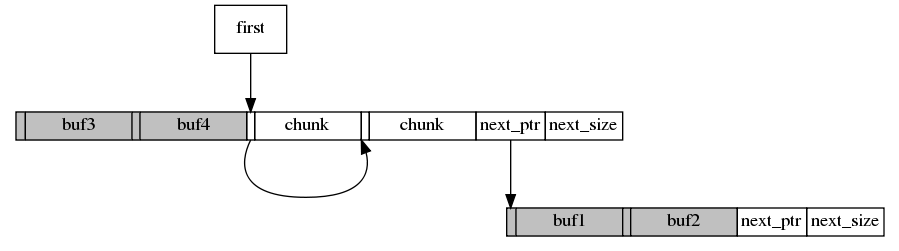 | 
释放buf1 | 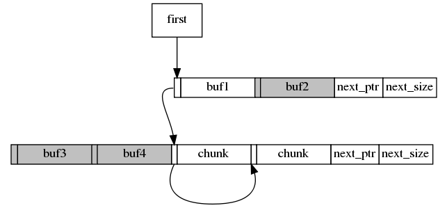 | 
释放buf2 | 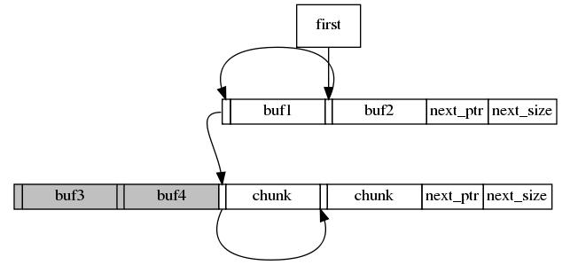 | 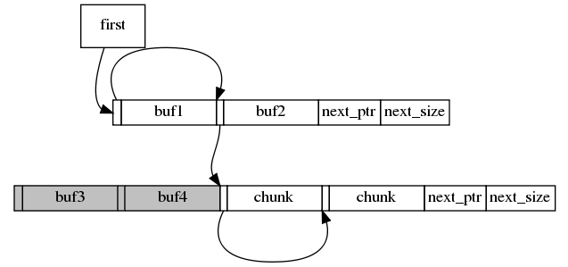
释放buf3 | 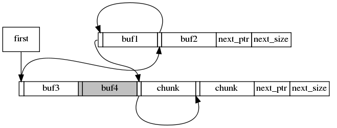 | 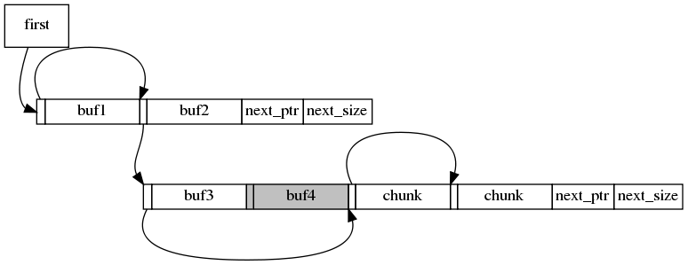
释放buf4 | 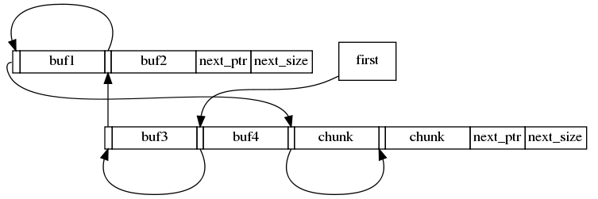 | 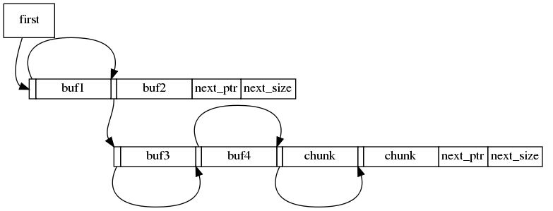

调用free之后，chunk的指向关系和chunk最初在block中被分割的顺序完全不一致，但每次释放只需在chunk链表的头部操作，因此效率非常高

而调用ordered_free后，所有chunk仍旧保持了最初分割时候的顺序，但是在释放每个chunk时，都需要从first开始查找，找到一个合适的位置进进行插入

## 清理内存
清理内存有如下连个接口

    static bool release_memory();
    static bool purge_memory();

purge_memory会将所有block无条件释放，即便有些chunk已经分配出去，因此要慎用。release_memory只对ordered内存池有效，会释放没有分配chunk的block，假设现在内存结构如下

block1的两个chunk都还没被分配出去，block2有一个chunk已分配出去，并且内存池为ordered结构，此时调用release_memory后，block1会被归还给操作系统，内存结构如下

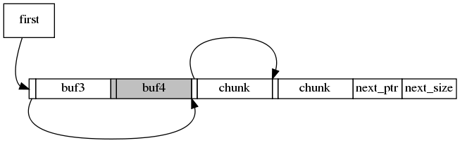

## 总结
boost内存池提供了丰富的接口，malloc和free都非常高效，但是由于是非ordered，无法手动回收内存，如果服务内存突增之后又降下来，内存池会一直占用峰值达到的内存

ordered内存池虽然支持内存回收，但分配效率不高，不推荐使用
