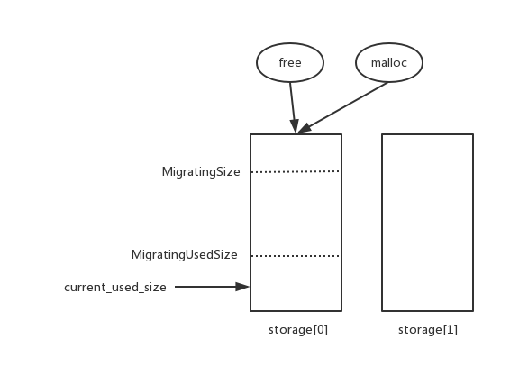
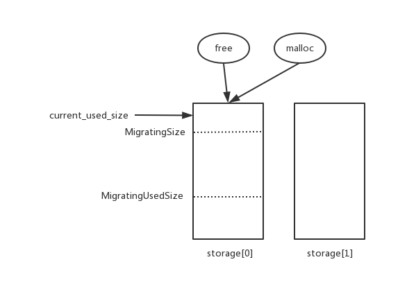
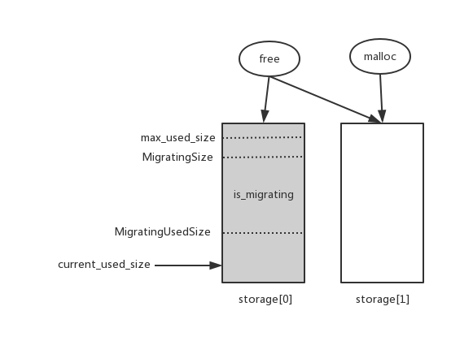
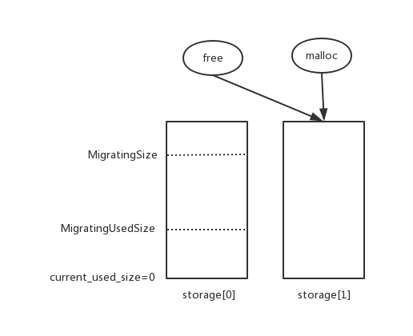

# 基于boost::pool实现可自动回收的内存池

## boost内存池缺点
boost提供了boost:pool和boost::singleton_pool两种内存池结构，其中boost::singleton_pool是基于boost::pool进行的封装，提供了多线程安全的访问以及单例的实现，boost内存池提供的是固定大小内存的分配和管理

虽然boost内存池可以在频繁分配释放内存场景下提高操作效率，减少内存碎片，但其非ordered结构的内存池无法自动释放空闲内存，而ordered结构的内存池又存在效率低下的问题。通常我们使用的都是ordered结构的内存池，如果服务在高峰期向内存池申请的内存峰值达到几G，后续又陆续归还内存，趋于平稳后可能只需要几百兆内存，而boost内存池一旦达到一个峰值，内存占用就不会降下来，虽然对本服务而言效率是提高了，但也占用了过多系统资源，甚至会影响同机其它服务的内存使用

## 设计思路
内存池并非是glibc内存管理器的替代品，而是基于特定场景的优化，通常我们使用内存池的场景有如下特点

1. 每次申请的内存大小固定
2. 频繁申请释放内存，不会申请之后一直不释放

基于以上两点设计migrating_pool，封装两个boost::pool对象，接口如下

	template <typename Tag,
	   unsigned RequestedSize,
	   unsigned MigratingSize = 1024*1024*1024,
	   unsigned MigratingUsedSize = 200 * 1024 * 1024,
	   unsigned MigratingDelaySec = 60,
	   unsigned NextSize = 32,
	   unsigned MaxSize = 0>
	class migrating_pool
	{
	public:
	    static void * malloc();
	    static void free(void * const ptr);
	    static void set_migrating_size(int size);
	    static void set_migrating_used_size(int size);
	    static void set_migrating_delay_sec(int sec);

	private:
		struct pool_type: public boost::pool<boost::default_user_allocator_new_delete>
		{
		}

		typedef boost::aligned_storage<sizeof(pool_type), boost::alignment_of<pool_type>::value> storage_type;
    	static storage_type storage[2];
	};

对外只提供malloc和free操作，屏蔽了ordered类操做以及release_memory和purge_memory，模板参数中Tag, RequestSize, NextSize, MaxSize均和boost::singleton_pool一致，主要增加了三个参数，用来控制内存池清理的条件，必要条件为

	用户向内存池申请的内存峰值 > MigratingSize && 用户当前向内存池申请的内存值 < MigratingUsedSize

意思很明显，即用户的内存使用曾经达到了一个很高的值，但后来又降下来

`MigratingDelaySec`用来控制内存池释放的时机

storage存储了两个boost::pool对象，初始情况下，所有malloc和free都由storage[0]处理，当storage[0]满足释放条件后，将会启用storage[1]，此时内存池进入迁移状态，所有malloc都由storage[1]处理，free由storage[0]和storage[1]共同处理，当storage[0]收回用户申请的所有内存后，将storage[0]所有内存进行释放，内存池又恢复初始状态，以此达到回收内存的目的

## 内存操作
这里详细描述内存池在不同状态下的操作方式

* 初始化，用户申请内存还没达到峰值，malloc和free都由storage[0]处理

* 用户分配内存达到峰值，超过MigratingSize ，malloc和free仍旧由storage[0]处理

* 用户释放内存，使用内存趋于平稳，低于MigratingSize，此时内存池进入迁移状态，storage[1]被启用，malloc由storage[1]处理，free由storage[0]和storage[1]共同处理

* 当storage[0]中的内存全部被归还，释放storage中所有内存，malloc和free都由storage[1]进行处理，此时和初始化状态一致，当前工作的pool对象由storage[0]变为了storage[1]

## 延迟释放
如果用户向内存池批量申请大量内存，又全部释放，反复这样操作，每次申请都能超过MigratingSize阈值，每次释放后都会低于MigratingUsedSize阈值，这会导致内存池频繁的释放整块内存，msgserver就可能有这种场景，其主线程处理过程简化如下

这里task的创建和释放使用了内存池。主线程循环调用poll和ProcessAllTask，其中poll会处理当前所有IO完成事件，如果此时消息量突增，poll有可能一次处理数十万事件，每个事件都会生成一个task放入队列，当poll调用完成后再处理队列里的task，并释放内存

这个过程会导致，当poll调用完成后，内存池会分配数十万chunk，但ProcessAllTask调用结束后，内存池又回收了这些chunk，如果按之前的条件

	用户向内存池申请的内存峰值 > MigratingSize && 用户当前向内存池申请的内存值 < MigratingUsedSize

则可能每次ProcessAllTask调用结束后都要清空内存池里的所有内存，而此时服务又处于高压力之下，难免会影响性能。对于这种情况，应该尽量复用内存池里的内存，而非只用一次就释放。因此引入延迟释放策略如下

>当内存池达到释放条件，且维持MigratingDelaySec时间后，才真正释放内存

如果在满足释放条件的MigratingDelaySec时间内内存使用又超过了MigratingUsedSize，则重新开始计算维持时间

这样可以保证内存池会在用户的实际内存使用量较小的情况下释放内存

## 使用示例
migrating_boost仍旧采用单例模式，使用方法和singleton_pool类似

	struct MyPoolTag                                                                                                                                                             
	{                                                                                                                                                                            
	                                                                                                                                                                             
	};

	typedef migrating_pool<MyPoolTag, 4*1024, 1024*1024*1024, 200*1024*1024> my_pool
	
	int main()
	{
		char * p = (char*)my_pool::malloc();
		my_pool::free(p);
		reutrn 0;
	}

详细实现见 [memory_pool/boost_migrating_pool.hpp](memory_pool/boost_migrating_pool.hpp)